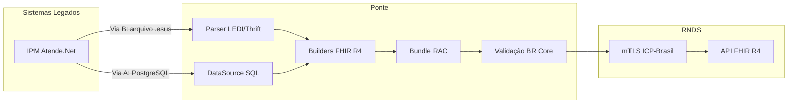

# Ponte

**Adaptador open-source para conectar sistemas legados de saúde à RNDS (Rede Nacional de Dados em Saúde).**

Em Santa Catarina, **74,9% dos municípios** não estão integrados à [RNDS](https://www.gov.br/saude/pt-br/composicao/seidigi/rnds). Muitos usam o IPM Atende.Net, que **não envia dados clínicos** à rede nacional. Quando uma gestante de alto risco chega à emergência de uma maternidade, o médico não tem acesso ao pré-natal — não sabe as alergias, os medicamentos, a idade gestacional.

**92% das mortes maternas no Brasil são evitáveis.** O Ponte existe para fechar esse gap.

## O que faz

O Ponte transforma dados do IPM Atende.Net em **Bundles RAC (Registro de Atendimento Clínico) FHIR R4**, conformes com os perfis [BR Core](https://hl7.org.br/fhir/core), prontos para envio à RNDS.

Duas vias de entrada de dados:



| Via | Entrada | Status |
|-----|---------|--------|
| **Via B** | Arquivos LEDI/Thrift (.esus) exportados pelo IPM | Implementada |
| **Via A** | Acesso direto ao banco PostgreSQL do IPM | Interface pronta, aguarda acesso |

## Cenário Maria (demo)

```bash
cd adapter && npm install && npm run demo
```

Maria, 39 anos, G3P1, gestante de alto risco na UBS Vila Nova. O demo gera um **Bundle RAC com 18 recursos FHIR R4**:

| Recurso | Dados |
|---------|-------|
| Patient | CPF validado, raça/cor, nome social, telefone, endereço |
| Encounter | Ambulatorial, diagnósticos referenciados |
| Condition (x2) | Diabetes gestacional (O24.4), Hipertensão gestacional (O13) |
| AllergyIntolerance | Penicilina (BR0270616U0118), gravidade alta, anafilaxia |
| MedicationStatement (x2) | Insulina NPH 10UI 2x/dia, Metildopa 250mg 3x/dia |
| Observation (x5) | PA 130/85, peso 78kg, glicemia 135 mg/dL, IG 32sem |
| Observation (DUM) | 2025-04-10 (LOINC 8665-2) |
| Observation (x2) | Histórico obstétrico: G3, P1 |
| Composition | RAC com 4 seções |
| Practitioner, Organization | CNS validado, CNES validado |

**Sem Ponte:** o obstetra opera às cegas.
**Com Ponte:** ele sabe tudo em segundos — alergias, medicamentos, idade gestacional, sinais vitais.

## Testes

```bash
cd adapter && npm test
```

**318 testes** em 19 arquivos — unitários, integração, edge cases.

## Conformidade

- Todos os 19 problemas de conformidade BR Core identificados e corrigidos
- Códigos reais das terminologias brasileiras (BRCID10, BRMedicamento/CATMAT, LOINC, UCUM)
- Validação CPF com algoritmo da Receita Federal
- Validação CNS (mod 11) e CNES (7 dígitos)
- UUIDs reais (crypto.randomUUID)

## Estrutura

```
ponte/
├── adapter/           ← Adaptador IPM → RNDS (TypeScript, 318 testes)
│   ├── src/
│   │   ├── builders/      Builders FHIR R4 (patient, condition, allergy, medication...)
│   │   ├── bundle/        RAC Bundle assembler
│   │   ├── datasource/    Interface IpmDataSource + MockDataSource
│   │   ├── ledi/          Parser LEDI/Thrift (zero deps, Via B)
│   │   ├── rnds/          Auth mTLS + Client (stubs)
│   │   ├── validation/    Validação local + CPF + CNS + CNES
│   │   └── types/         Tipos IPM e LEDI
│   ├── tests/             19 arquivos de teste
│   └── demo.ts            Demo CLI (cenário Maria)
├── brain/             ← Memória persistente (estado, pensamentos, pesquisas)
├── evidence/          ← 17 pesquisas documentadas
├── docs/              ← One-pager, pitch, abstract CBIS 2026
├── bridge/            ← Protótipo conceitual original (legado)
└── protocol/          ← Especificação do protocolo v0.1
```

## Dependências

Apenas 2 dependências de produção:
- `@medplum/core` — validação FHIR R4
- `@medplum/fhirtypes` — tipos TypeScript para FHIR R4

## Status

**Fase: Adaptador MVP construído. Buscando município parceiro para piloto.**

- [x] Adaptador IPM → RNDS com Bundle RAC FHIR R4 (318 testes)
- [x] Parser LEDI/Thrift para arquivos .esus (Via B)
- [x] Conformidade completa com perfis BR Core
- [x] 17 pesquisas de evidência (mortalidade materna, regulamentações, terminologias)
- [x] Processo de credenciamento RNDS mapeado
- [ ] **Município parceiro no Vale do Itajaí, SC** — blocker atual
- [ ] Homologação com RNDS real (depende de CNES + certificado ICP-Brasil)
- [ ] Piloto com dados reais

## Contexto regulatório

O timing é urgente. Em 12 meses, o governo publicou 5 regulamentos que convergem na mesma direção:

| Regulamento | O que exige |
|-------------|-------------|
| Decreto 12.560/2025 | RNDS = plataforma oficial do SUS |
| Portaria 5.663/2024 | Thrift descontinuado, FHIR R4 obrigatório para vacinação |
| Portaria 7.495/2025 | Municípios sem RNDS perdem acesso a programas federais |
| Portaria 8.025/2025 | SAO (Sumário de Alta Obstétrico) na RNDS |
| Portaria 6.656/2025 | Regulação assistencial via RNDS obrigatória |

Municípios que usam IPM e não integram com RNDS estão em risco de perder recursos federais. O Ponte é a solução que permite cumprir as portarias **enquanto** o IPM não implementa nativamente.

## Como contribuir

- Você trabalha no SUS em SC? Conte como funciona a troca de informação entre unidades na sua região
- Você conhece município que usa IPM e quer integrar com RNDS? Nos conecte
- Você trabalha com FHIR/RNDS? Revise nossos Bundles e builders

Abra uma [issue](https://github.com/Moser007/ponte/issues) ou entre em contato.

## Licença

[MIT](LICENSE) — use, modifique, distribua. Sem restrições.
